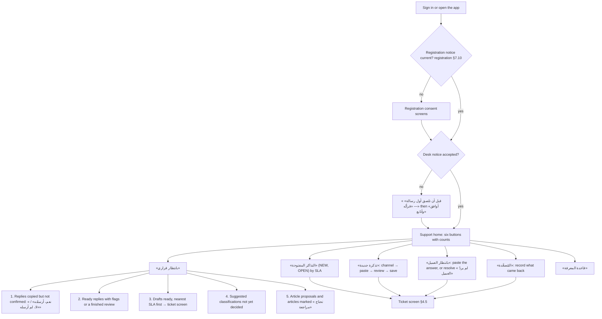
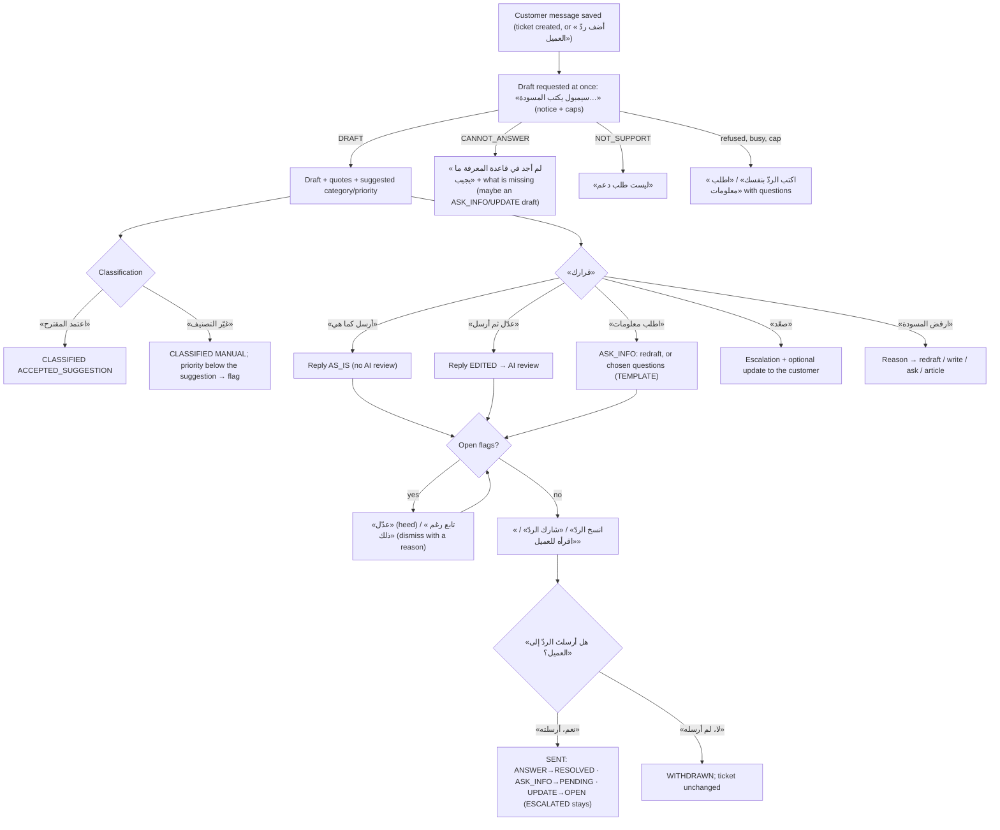

---

## 3. The employee's day and every decision, as flows

### 3.1 Starting the day



- **Order on «بانتظار قراري».** Confirmations come first. A reply copied yesterday and never confirmed is either sent, which leaves the ticket's status and SLA wrong, or unsent, which leaves the customer waiting. Then flags, then drafts by SLA, then classifications, then knowledge-base items.
- **Automatic closing** runs when the home loads (`ew_support_close_due()` for the session user) and daily for everyone (`purge`). A resolved ticket closes 4 days after resolution; any ticket idle for 90 days closes.
- **Nothing to finish at the end of the day.** SLA clocks are calendar hours. Copied replies still awaiting confirmation stay at the top of «بانتظار قراري».

### 3.2 A ticket, decision by decision



Every row below is enforced by the named database function. Audit events are written in the same transaction (§5).

| # | Decision (button) | Allowed when (enforced) | Function | Ticket status after | Audit (`support_events.event` · detail) |
|---|---|---|---|---|---|
| D1 | «اعتمد المقترح» / «غيّر التصنيف» | Not `CLOSED`. Accepting must match the draft's suggestion exactly. | `ew_support_set_ticket` | unchanged | `CLASSIFIED` · `ACCEPTED_SUGGESTION`/`MANUAL`; `SUBJECT_SET`; `FLAG_RAISED` · `PRIORITY_BELOW_SUGGESTION` |
| D2 | «أرسل كما هي» | The latest draft, not rejected, with a body. An `ANSWER` is not allowed while `ESCALATED`. | `ew_support_prepare_reply` (the database decides `AS_IS`) | after confirmation, by kind | `REPLY_PREPARED` · `AS_IS` |
| D3 | «عدّل ثم أرسل» | as D2 | `ew_support_prepare_reply` → `EDITED`; then `ew_support_begin_review` / `ew_support_record_review` | after confirmation, by kind | `REPLY_PREPARED` · `EDITED`; `REVIEW_DONE`/`REVIEW_FAILED`/`REVIEW_SKIPPED`; `FLAG_RAISED` |
| D4 | «اطلب معلومات» | Not `CLOSED` | redraft with preset `ASK_INFO`, or `ew_support_prepare_reply` with `p_template` (`TEMPLATE`) | `PENDING` (`ESCALATED` stays) | `REPLY_PREPARED` · `TEMPLATE`/`AS_IS`/`EDITED` |
| D5 | «صعّد» | `NEW`, `OPEN` or `PENDING` | `ew_support_escalate` (+ an optional `UPDATE` reply) | `ESCALATED` | `ESCALATED` · target; `STATUS_CHANGED` |
| D6 | «ارفض المسودة» | The draft is in no ready, released or sent reply | `ew_support_reject_draft` | unchanged | `DRAFT_REJECTED` · reason. `WRONG_INFO`/`OUTDATED_ARTICLE` mark the quoted articles «تحتاج مراجعة». |
| D7 | «حُلّت دون ردٍّ مكتوب» | `NEW`, `OPEN` or `PENDING`, with no live reply. An unanswered customer message needs a confirmation or a phone/in-person resolution. | `ew_support_resolve` | `RESOLVED` | `RESOLVED` · `BY_PHONE`/`IN_PERSON`/`DUPLICATE`/`NOT_SUPPORT`/`NO_RESPONSE`; `FLAG_DISMISSED` · `CONFIRMED` |
| D8 | «انسخ الردّ» / «شارك الردّ» / «اقرأه للعميل» | `READY`; hash equal; no open flag; review not waiting unless skipped | `ew_support_release_reply` | unchanged | `REPLY_RELEASED` · `COPY`/`SHARE`/`SCRIPT`; `REVIEW_SKIPPED` |
| D9 | «نعم، أرسلته» / «لا، لم أرسله» | `RELEASED` (sent); `READY` or `RELEASED` (withdrawn) | `ew_support_confirm_reply` | by kind / unchanged | `REPLY_SENT` · kind; `RESOLVED` · `REPLIED` / `REPLY_WITHDRAWN` |
| D10 | «عدّل» / «تابع رغم ذلك» on a flag | The flag is `OPEN` | `ew_support_ack_flag` | unchanged | `FLAG_HEEDED` / `FLAG_DISMISSED` · reason |
| D11 | «أضف ردّ العميل» / «ملاحظة داخلية» | Not `CLOSED`; desk notice accepted | `ew_support_add_message` | `PENDING`/`RESOLVED` → `OPEN` for a customer message | `CUSTOMER_MESSAGE_ADDED` / `NOTE_ADDED` |
| D12 | «عاد الجواب من التصعيد» | `ESCALATED`, no live reply | `ew_support_return_escalation` | `OPEN` | `ESCALATION_RETURNED` · target |
| D13 | «أعد فتح التذكرة» | `RESOLVED` | `ew_support_reopen` | `OPEN` | `REOPENED` |
| D14 | «افتح تذكرة متابعة» | `CLOSED` | `ew_support_follow_up` | a new `NEW` ticket that points to the old one | `FOLLOW_UP_CREATED` |
| D15 | «أعد الكتابة» (presets: «أقصر», «أبسط», «أكثر رسمية», «أدفأ», «اطلب معلومات» + an optional note) | The AI caps; at most 8 drafts per ticket per day | `ew_support_begin_draft` / `ew_support_record_draft` | unchanged | `DRAFT_REQUESTED`; `DRAFT_PROPOSED` · result / `DRAFT_FAILED` · outcome |
| K1 | «مقالة جديدة» / «احفظ نسخةً جديدة» | At most 300 articles, 30 versions each, 100 versions a day | `ew_kb_create` / `ew_kb_add_version` | — | `ARTICLE_CREATED` / `ARTICLE_VERSION_ADDED` |
| K2 | «اعتمد المقالة» | The latest version; no open flag on it; no review running | `ew_kb_publish` | `PUBLISHED` | `ARTICLE_PUBLISHED` · `V3` |
| K3 | «أرشف» / «تجاهل الاقتراح» | The state machine | `ew_kb_set_state` | `ARCHIVED` / `DISCARDED` | `ARTICLE_ARCHIVED` / `ARTICLE_DISCARDED` |
| K4 | «علّمها تحتاج مراجعة» / «أُصلحت» | `PUBLISHED` | `ew_kb_mark_review` | — | `ARTICLE_MARKED_REVIEW` / `ARTICLE_REVIEW_CLEARED` |
| K5 | «اقترح مقالة من هذه التذكرة» | The ticket has a sent reply or a `NOT_IN_KB` rejection; at most 2 proposals per ticket | `ew_kb_begin_proposal` / `ew_kb_record_proposal` | a `PROPOSED` article | `ARTICLE_PROPOSED` |

**The automatic draft.** When a ticket is saved or a customer message is added, the client requests a draft at once (`POST …/drafts`). The AI acts as the agent without a press; it still only proposes.
- The screen shows «سيمبول يكتب المسودة…» with «اكتب الردّ بنفسك» available.
- When the caps or the service refuse, the ticket shows the reason (§6.4) and the manual paths.

---

## 4. Screens

**Common to every screen** (the visual track's shell and tokens):

- The header has «رجوع» at the start and the section name. The sections menu and the floating tools button (`ToolsFab`, bottom end, which is the left in RTL; §9) are on every screen. Icons never stand alone: every icon has text beside it.
- **Compact (default).**
  - Every hit region is at least 44×44 pt: `h-ctl` 44, `gap-tg` 12 (at least 8 between rows and tabs), body text 16 px.
  - Lists show 20 items per server page with «السابق» and «التالي»; the page may scroll.
- **Gaze.**
  - Targets are 72 px with 24 px gaps, and nothing scrolls inside a step. Each screen is a `Stepper` of steps; the bottom bar holds «السابق» and «التالي».
  - **Long text** (a customer message, a draft, an article) is split client-side into pages that fit: at paragraph boundaries first, then sentences. The step shows «الصفحة ١ من ٣», and «التالي» moves to the next page before the next step.
  - **Lists** page by fit: the client measures rows, gives each screen page as many as fit fully (at least one), and shows «١–٣ من ١٢». A row's text is never truncated.
  - **No commit under a resting gaze.** A button that commits (send, release, confirm, publish, resolve, escalate) is never placed where the press that revealed it was. The bottom-end slot of a step that shows commits holds «السابق» or nothing.
- **Numbers and times.** Shown with the app's existing formatting (`arabic_numbers`), in Riyadh time: «اليوم ١٠:٤٢», «أمس», «٣ أكتوبر».
- **Every error message is the server's Arabic text** (§6.4), shown in an `Alert` in the step that failed.

### 4.0 The workspace entry (replaces the SUPPORT placeholder in `client/src/lib/workspace.ts`)

```ts
SUPPORT: {
  profession: "SUPPORT",
  name: "الدعم الفني",
  home: "home",
  sections: [
    { id: "home",      label: "الرئيسية",        description: "ابدأ العمل من هنا",               icon: LayoutDashboard },
    { id: "decide",    label: "بانتظار قراري",    description: "مسوداتٌ وتنبيهاتٌ وردودٌ تنتظرك", icon: Inbox },
    { id: "open",      label: "التذاكر المفتوحة", description: "الأقرب موعداً أولاً",             icon: Headset },
    { id: "pending",   label: "بانتظار العميل",   description: "طلبتَ منه معلومات",               icon: Clock },
    { id: "escalated", label: "المُصعَّدة",        description: "عند جهةٍ أخرى",                   icon: Users },
    { id: "kb",        label: "قاعدة المعرفة",     description: "ما يستند إليه سيمبول",            icon: LibraryBig },
  ],
  shortcuts: [
    { id: "new",    label: "تذكرة جديدة",     description: "الصق رسالة العميل", icon: Plus,  route: "#/s/open/new" },
    { id: "next",   label: "التذكرة التالية", description: "الأقرب موعداً",     icon: Inbox, route: "#/s/open/next" },
    { id: "decide", label: "بانتظار قراري",   description: "ما ينتظر ضغطتك",   icon: Inbox, route: "#/s/decide" },
  ],
  help: {
    home:      { title: "الرئيسية", lines: ["ابدأ يومك من «بانتظار قراري»: ما نسختَه ولم تؤكّد إرساله أولاً."] },
    decide:    { title: "بانتظار قراري", lines: ["سيمبول يقترح، وأنت تقرّر. لا يصل العميلَ شيءٌ إلا بضغطتك."] },
    open:      { title: "التذاكر المفتوحة", lines: ["الأقرب موعداً للردّ أولاً، ثم الأعلى أولوية."] },
    pending:   { title: "بانتظار العميل", lines: ["طلبتَ من العميل معلومات. الصق ردّه حين يصل."] },
    escalated: { title: "المُصعَّدة", lines: ["تذاكر عند جهةٍ أخرى. سجّل ما عاد منها لتكمل الردّ."] },
    kb:        { title: "قاعدة المعرفة", lines: ["المقالات المعتمدة وحدها يقرؤها سيمبول ويقتبس منها."] },
  },
},
```

### 4.1 Home (`#/s/home`): the six work buttons

| Component | Compact | Gaze |
|---|---|---|
| Six `Button`s (variant `secondary`), each icon + label + count `Badge`: «بانتظار قراري», «التذاكر المفتوحة», «تذكرة جديدة» (primary, no count), «بانتظار العميل», «المُصعَّدة», «قاعدة المعرفة» (count = articles «تحتاج مراجعة» + proposals) | A 2-column grid; each at least 64 px tall; `gap-tg` 12 | A 2-column grid; each 72 px or taller; 24 px gaps. The count is on the label's line («بانتظار قراري · ٣»). It fits without scrolling (tested at 320×568, 375×635 and 390×664, and at Text Size AX5). |
| `ToolsFab` | 48 px pill «الأدوات» | 72 px square |

- **Empty state.** The buttons are always shown; a zero count shows no badge. Nothing to read comes before the buttons.
- **The first visit** shows the desk notice (§10.2) before the home; «ليس الآن» returns to the home with the four ticket buttons disabled and the line «لا تُحفظ رسائل العملاء قبل الموافقة على الإشعار.». «قاعدة المعرفة» works without the notice.

### 4.2 «بانتظار قراري» (`#/s/decide`)

- **Rows.** Each row is a `Button` that opens the ticket at the right step:
  - «أكّد الإرسال · #١٢ · {subject}»
  - «تنبيهٌ على ردّ · #١٢»
  - «مسودةٌ جاهزة · #١٢ · {SLA chip}»
  - «تصنيفٌ مقترح · #١٢»
  - «مقالةٌ مقترحة · KB-٩ · {title}»
  - «مقالةٌ تحتاج مراجعة · KB-٤»
- **Compact:** a list in `Card`s, 20 per page, «السابق»/«التالي». **Gaze:** paged by fit, one row is one 72 px+ target.
- **Empty state:** «لا شيء ينتظر قرارك الآن.» and a button «التذاكر المفتوحة».

### 4.3 Ticket lists (`#/s/open`, `#/s/pending`, `#/s/escalated`)

- **The row.**
  - Line 1: «#١٢ · {subject, or the first 60 characters of the first customer message}»
  - Line 2: priority `Badge` («عاجلة», «عالية», «عادية», «منخفضة»), category, channel, the customer's label, and the SLA chip:
    - «متبقٍّ ٣٥ د» before the first reply is due;
    - «تأخّر الردّ ١ س» after it;
    - «متبقٍّ للحلّ ٥ س» after a reply;
    - «متوقّف» while the requester-wait clock is paused (`PENDING`).
  - State badges: «مسودة جاهزة», «بانتظار تأكيد الإرسال», «تنبيه», «أولوية مقترحة: عاجلة».
- **Order.**
  - Open: overdue first reply first, then the nearest due time (first reply if none yet, otherwise resolution), then priority, then age.
  - Pending: longest waiting first.
  - Escalated: oldest escalation first.
- **Filters.** The open list has «المحلولة» and «المغلقة» views, for reopening and follow-ups.
  - Compact: `Tabs` of 44 px.
  - Gaze: an «العرض: …» button opens a step listing the views as 72 px buttons.
- **Compact:** `DataTable` rows of 52 px (a 44 px target inside), 20 per page. **Gaze:** rows paged by fit.
- **Empty states:**
  - «لا تذاكر مفتوحة. الصق رسالة عميلٍ لتبدأ.» + «تذكرة جديدة»
  - «لا أحد بانتظار ردّه.»
  - «لا تذاكر عند جهةٍ أخرى.»

### 4.4 New ticket (`#/s/open/new`)

| Step (gaze) / section (compact) | Components and copy |
|---|---|
| 1. «من أين وصلت الرسالة؟» | `RadioCards` with six options: «واتساب أو رسائل», «بريد», «مكالمة», «حضوري», «نموذج جهة العمل», «أخرى» |
| 2. «رسالة العميل» | `Button` «الصق من الحافظة» (`navigator.clipboard.readText()` inside the press; Safari shows its own "Paste"), a `Textarea` (1–4000 characters, with a counter «٢٣٠ من ٤٠٠٠»), and the hint «الصق ما يلزم لحلّ المشكلة وحده. يُحذف البريد والروابط والأرقام الطويلة قبل الحفظ.» For «مكالمة» and «حضوري» the label becomes «ما قاله العميل». |
| 3. «راجع قبل الحفظ» | The preview from `POST /api/support/mask-preview`, with the masks shown as badges; the line «حُذف: بريدٌ واحد، ورقمان، ورابطٌ واحد.»; an optional `Input` «اسم العميل للتحية» (≤30, letters and digits, never sent to the AI); an optional `Input` «الموضوع» (3–80); `RadioCards` «الأولوية» (default «عادية»); `Button` «احفظ التذكرة» |

- **Compact:** one `Card` with the three sections. The preview appears after the paste (debounced 400 ms). The optional fields sit under «تفاصيل اختيارية».
- **Gaze:** three steps. The text field opens the system keyboard only on «اكتب بنفسك»; paste is the default.
- **After saving:** the ticket screen opens with «سيمبول يكتب المسودة…». If the notice is not accepted, the request is refused (`NOTICE`) and the notice opens.

### 4.5 The ticket (`#/s/open/t/{id}`; the same screen from every list)

| Part | Compact (one column) | Gaze (one step each) |
|---|---|---|
| Header | «رجوع» · «#١٢ · {subject}» · status `Badge` · SLA chip | Same; the subject is paged if long |
| «اقتراح سيمبول» | A `Card`: «الفئة: الشبكة والإنترنت · الأولوية: عاجلة» and the reason «لأن الرسالة تذكر توقّف العمل لأكثر من مستخدم» (from impact and urgency, §8.4.2); «اعتمد المقترح» / «غيّر التصنيف» (a `Sheet` with the categories and priorities). Hidden once decided and matching. | Step «اقتراح سيمبول»; «غيّر التصنيف» opens two steps (category, then priority) |
| Thread | Messages oldest to newest, the latest customer message expanded; «رسائل سابقة (٣)» collapsed. Labels «العميل», «ردّك», «ملاحظة داخلية»; masks as badges. | Step «رسالة العميل», paged; «المحادثة كاملة» opens a paged list |
| «مسودة سيمبول» | `Card`: the kind («جوابٌ يحلّ المشكلة», «طلب معلومات», «إفادةٌ بالمتابعة»), the body, quotes as `InlineCitation` chips «KB-٧» (a popover with the article title and the exact quote), `note_to_employee` in a muted line by the Symbol mark, and «يقترح التصعيد إلى: المورّد» when set | Step «المسودة», paged; a second step «من قاعدة المعرفة» lists each quote with its article title, one per page |
| `CANNOT_ANSWER` | `Alert` «لم أجد في قاعدة المعرفة ما يجيب: {note}», then «اكتب مقالة», «اطلب معلومات», «اكتب الردّ بنفسك», and the draft's `ASK_INFO`/`UPDATE` body if present | The same, as a step |
| `NOT_SUPPORT` | `Alert` «ليست طلب دعم: {note}» + «حُلّت: ليست طلب دعم» (D7) + «اكتب الردّ بنفسك» | The same |
| «قرارك» (the adapted 21st.dev `approval-card`) | «أرسل كما هي» (primary), «عدّل ثم أرسل», «اطلب معلومات», «صعّد», «ارفض المسودة». Then a secondary row: «أعد الكتابة», «أضف ردّ العميل», «ملاحظة داخلية», «حُلّت دون ردٍّ مكتوب», «سجلّ القرارات» | Step «قرارك»: the five buttons stacked (5×72 + 4×24 = 456 px); «المزيد» opens a step with the secondary actions. The bottom-end slot is empty. |
| A live reply | Replaces «قرارك» with the reply card (§4.8) | Opens at the reply's step |

- **AI unavailable or capped:** «مسودة سيمبول» shows the server's message and «اكتب الردّ بنفسك» / «اطلب معلومات».
- **Stale:** a 409 `STALE` reloads the ticket and says «تغيّرت التذكرة منذ عرضها. راجعها مرة أخرى.».

### 4.6 «عدّل ثم أرسل» and «اكتب الردّ بنفسك»

| Step (gaze) / tool (compact) | Components |
|---|---|
| «ما الذي تغيّره؟» | `RadioCards`: «احذف جملاً» · «أضف عبارةً جاهزة» · «أضف من قاعدة المعرفة» · «اكتب بنفسك» · «اطلب من سيمبول تعديلها» |
| «احذف جملاً» | The draft split into sentences, each a toggle (72 px in gaze, 44 in compact), with the line «اضغط جملةً لحذفها». Editing without typing. |
| «أضف عبارةً جاهزة» | The phrases from §9 as buttons; one press appends the phrase |
| «أضف من قاعدة المعرفة» | Search field + results; «أدرج الحلّ» appends the article's resolution steps and remembers the article for grounding (§7.3) |
| «اكتب بنفسك» | A `Textarea` (20–1200 characters) |
| «اطلب من سيمبول تعديلها» | Presets «أقصر», «أبسط», «أكثر رسمية», «أدفأ» (two at most, never «أكثر رسمية» with «أدفأ») + optional «ملاحظةٌ لسيمبول» (≤200) → a new draft (D15) |
| «نوع الردّ» | `RadioCards`: «يحلّ المشكلة» (ANSWER), «يطلب معلومات» (ASK_INFO), «يُفيد بالمتابعة» (UPDATE) |
| «الردّ كما سيصل» | The composed text (greeting + core + signature), paged in gaze; `Button` «جهّز الردّ» |

### 4.7 «اطلب معلومات»

- «اطلب من سيمبول صياغتها»: a redraft with preset `ASK_INFO` (D15), then D2 or D3.
- «اختر الأسئلة»: the adapted 21st.dev `question-tool`, multi-select, one to four of the questions in §8.6. It yields a `TEMPLATE` reply, then §4.8. Gaze: one question per row, 72 px toggles, paged by fit.

### 4.8 The reply: review, release, confirm

| Step | Components and copy |
|---|---|
| «الردّ كما سيصل» | The final text (paged in gaze); «سيمبول يراجع الردّ…» while the review runs, with «أرسل دون انتظار المراجعة» |
| «تنبيهات» (only if any) | One `AIFlag` per flag: «يا {الاسم}، {message}» + «السبب: {reason}» + the quote. «عدّل» (heed: the reply is withdrawn and the composer reopens with its text) / «تابع رغم ذلك» (dismiss: «تنبيهٌ في غير محلّه», «جهة العمل موافقة», «المقالة قديمة», «سببٌ آخر») |
| «أرسل الردّ» | «انسخ الردّ»; «شارك الردّ» (only if `navigator.share` exists); «اقرأه للعميل» (first for «مكالمة» and «حضوري»). The line «لا يُرسل التطبيق شيئاً؛ الصق الردّ في محادثة العميل وأرسله أنت.» |
| «هل أرسلتَ الردّ إلى العميل؟» | «نعم، أرسلته» / «لا، لم أرسله». In gaze this is a separate step, and «نعم، أرسلته» is not where «انسخ الردّ» was. |
| «اقرأه للعميل» | The text alone at the body size, paged; «انتهيت» leads to the confirmation step |

- **Copy failure** (`NotAllowedError`): «تعذّر النسخ. اضغط «انسخ الردّ» مرةً أخرى.» Nothing is recorded, because release is recorded only after the copy succeeds.
- **Share cancelled** (`AbortError`): nothing is recorded.

### 4.9 «صعّد», «ارفض المسودة», «حُلّت دون ردٍّ مكتوب»

- **«صعّد».**
  1. «إلى من؟»: `RadioCards` «فريق الدعم المتقدّم», «المشرف», «المورّد أو الشركة المصنّعة», «فنيّ ميداني», «فريقٌ آخر في جهة العمل».
  2. «ملاحظة التصعيد»: a `Textarea` (10–1000) prefilled with «التذكرة #١٢ · {الفئة} · أولوية {الأولوية}\nالمشكلة: {أول 200 حرف من آخر رسالة}\nما جُرّب: », plus «انسخ ملخّص التصعيد».
  3. «أبلغ العميل؟»: «نعم، بردٍّ يفيد بالإحالة» (an `UPDATE` template, §8.6) / «لا الآن».
  4. «صعّد التذكرة».
- **«ارفض المسودة».**
  1. «لماذا؟»: `RadioCards` «معلومةٌ خاطئة», «القاعدة لا تغطّي المسألة», «لم يفهم المشكلة», «الأسلوب غير مناسب», «أطول من اللازم», «ناقصة», «المقالة قديمة», «سببٌ آخر».
  2. «ملاحظة» (optional, ≤200).
  3. «ماذا بعد؟»: «أعد الكتابة» · «اكتب الردّ بنفسك» · «اطلب معلومات» · «اكتب مقالة» (for «القاعدة لا تغطّي المسألة») · «علّم المقالة تحتاج مراجعة» (already done by the database for «معلومةٌ خاطئة» and «المقالة قديمة»; the step says «عُلّمت المقالة KB-٧ «تحتاج مراجعة».»).
- **«حُلّت دون ردٍّ مكتوب».**
  - `RadioCards`: «حُلّت بالهاتف», «حُلّت حضورياً», «مكرّرة», «ليست طلب دعم», «لم يردّ العميل» (only from «بانتظار العميل»).
  - If the last customer message is unanswered: «تذكير: آخر رسالةٍ من العميل بلا ردّ.» with «أغلقها رغم ذلك» and «رجوع».

### 4.10 «قاعدة المعرفة» (`#/s/kb`)

| Screen | Components |
|---|---|
| List | Search `Input` (compact) or a search step (gaze); views «المنشورة», «تحتاج مراجعة», «مسوداتي», «اقتراحات سيمبول», «المؤرشفة» (Tabs / a view step); rows «KB-٧ · {title}» + state `Badge` + «استُعملت ٥ مرات»; 20 per page / paged by fit; «مقالة جديدة»; «تحسين المسودات» (§4.11) |
| Article | Title; «المشكلة كما يصفها العميل»; «البيئة»; «الحلّ» (numbered); «السبب»; «النسخة ٣ · اعتُمدت اليوم ١٠:٤٢»; buttons «عدّل», «اعتمد» (when the latest version is unpublished), «علّمها تحتاج مراجعة» / «أُصلحت», «أرشف», «تجاهل الاقتراح» (proposals), «سجلّ المقالة». Gaze: one field per page. |
| Editor | Inputs: «العنوان» (4–80), «المشكلة كما يصفها العميل» (10–400), «البيئة: الجهاز والنظام والبرنامج» (optional, 3–300), «الحلّ خطوةً خطوة» (20–4000), «السبب» (optional, 3–400); «احفظ». Gaze: one field per step. From a ticket: «يقترح سيمبول من التذكرة» (K5). |
| Publish | «اعتمد المقالة» runs the article review first (§8.4): «سيمبول يراجع المقالة…», then flags (`AIFlag`), then «اعتمد المقالة» on a separate step |

- **Empty state:** «لا مقالات بعد. كل مقالةٍ تعتمدها هنا يقتبس منها سيمبول في مسوداته.» + «مقالة جديدة».

### 4.11 «تحسين المسودات» (inside «قاعدة المعرفة»)

- «لماذا رُفضت المسودات (آخر 30 يوماً)»: one row per reason with its count, e.g. «القاعدة لا تغطّي المسألة · ٧».
- «ثغرات القاعدة»: each `NOT_IN_KB` rejection whose ticket texts still exist: «#١٢ · {note}» → «اكتب مقالة» / «اقترح سيمبول مقالة».
- «مقالاتٌ تحتاج مراجعة»: rows → article.
- Gaze: each list is paged by fit.

### 4.12 «إعدادات الدعم» (from «حسابي»)

- «التوقيع» (`Input`, 2–60, one line; default empty; placeholder «مثلاً: فريق الدعم الفني»).
- «أهداف زمن الخدمة»: for each priority, «أول ردّ خلال» (`RadioCards`: «نصف ساعة», «ساعة», «ساعتان», «٤ ساعات», «٨ ساعات», «يوم») and «الحلّ خلال» («٤ ساعات», «٨ ساعات», «يوم», «يومان», «٣ أيام», «٥ أيام»). Gaze: one priority per step.
- «استعمال سيمبول اليوم»: «المسودات ١٢ من ٦٠ · المراجعات ٣ من ٦٠ · اقتراح المقالات ٠ من ١٠ · مراجعة المقالات ١ من ٢٠».
- «إشعار مكتب الدعم»: shows §10.2 and the accepted version.

### 4.13 «سجلّ القرارات» (per ticket and per article)

- Rows: time (Riyadh), actor («أنت», «سيمبول», «النظام»), the event, and the detail.
  - Example: «اليوم ١٠:٤٢ · أنت · أرسلتَ الردّ · جوابٌ يحلّ المشكلة».
  - Example: «أمس ١٦:٠٥ · النظام · أُغلقت التذكرة · بعد أربعة أيام من حلّها».
- 20 per page / paged by fit. The event labels are in §6.5.
